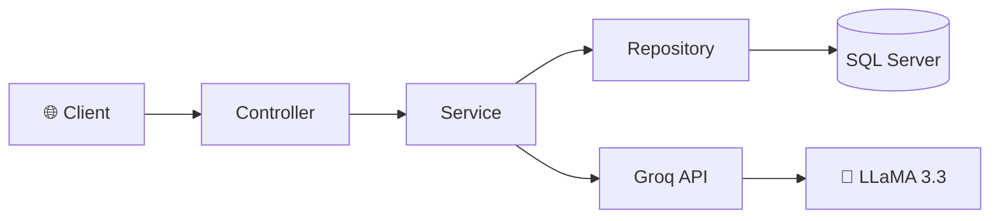
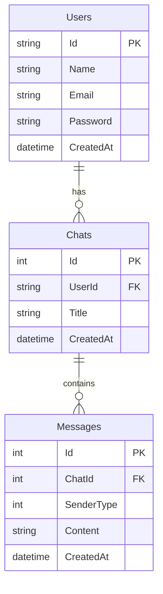

<div align="center">

# 🤖 SK.AI — Smart Chat Assistant

<p>
  
  
  
  
  
</p>

**A modern, real-time AI chatbot web application built with ASP.NET Core MVC and powered by Groq's ultra-fast LLaMA 3.3 model.**

[Features](#-features) · [Architecture](#-architecture) · [Getting Started](#-getting-started) · [Configuration](#%EF%B8%8F-configuration) · [Contributing](#-contributing)

---

</div>

## ✨ Features

| Feature | Description |
|---|---|
| 💬 **Real-time AI Chat** | Instant responses powered by Groq's blazing-fast inference engine |
| 🧠 **Conversation Memory** | Full chat history with context — the AI remembers your conversation |
| 📂 **Chat Management** | Create, switch between, and delete multiple chat sessions |
| 🔐 **Authentication** | Secure login & registration with password hashing (BCrypt) |
| 🌐 **Google OAuth** | One-click sign-in with Google account |
| 🎨 **Modern UI** | Clean, responsive interface inspired by ChatGPT |
| 📱 **Sidebar Navigation** | Collapsible sidebar with chat history |
| ⚡ **Ultra-Fast Responses** | Groq delivers AI responses in milliseconds |

---

## 🏗 Architecture

The project follows a **clean layered architecture** with clear separation of concerns:

```
Chat_Ai/
├── 📁 Controllers/          # Handle HTTP requests & routing
│   ├── AccountController     # Auth (Login, Register, Google OAuth, Logout)
│   ├── ChatController        # Chat operations (Send, History, Delete)
│   └── HomeController        # Landing page
│
├── 📁 Models/                # Entity Framework models
│   ├── User                  # User entity
│   ├── Chat                  # Chat session entity
│   ├── Message               # Individual message entity
│   └── MyDbContext            # EF Core database context
│
├── 📁 DTOs/                  # Data Transfer Objects
│   ├── LoginDto              # Login form data
│   ├── RegisterDto           # Registration form data
│   ├── SendMessageDto        # Chat message payload
│   └── AuthResultDto         # Authentication response
│
├── 📁 Services/              # Business logic layer
│   ├── AuthService           # Authentication & user management
│   ├── ChatService           # Chat session & message orchestration
│   └── GroqService           # Groq AI API integration
│
├── 📁 Repositories/          # Data access layer
│   ├── UserRepository        # User CRUD operations
│   ├── ChatRepository        # Chat CRUD operations
│   └── MessageRepository     # Message CRUD operations
│
├── 📁 Views/                 # Razor views (UI)
│   ├── Home/                 # Chat interface
│   ├── Account/              # Login & Register pages
│   └── Shared/               # Layout & shared components
│
└── 📁 wwwroot/               # Static assets
    ├── css/                  # Stylesheets
    └── js/                   # Client-side JavaScript
```

### Design Pattern



---

## 🚀 Getting Started

### Prerequisites

- [.NET 10 SDK](https://dotnet.microsoft.com/download/dotnet/10.0)
- [SQL Server](https://www.microsoft.com/sql-server) (LocalDB or full instance)
- [Groq API Key](https://console.groq.com/keys) (free)

### 1. Clone the Repository

```bash
git clone https://github.com/sajaalkhatib/Chat_Ai.git
cd Chat_Ai
```

### 2. Configure the Application

Copy the template and add your credentials:

```bash
cp Chat_Ai/appsettings.json Chat_Ai/appsettings.Development.json
```

Edit `appsettings.json` with your settings:

```json
{
  "ConnectionStrings": {
    "MyConnectionString": "Server=YOUR_SERVER;Database=Chat_AI;Trusted_Connection=True;TrustServerCertificate=True;"
  },
  "Authentication": {
    "Google": {
      "ClientId": "YOUR_GOOGLE_CLIENT_ID",
      "ClientSecret": "YOUR_GOOGLE_CLIENT_SECRET"
    }
  },
  "Groq": {
    "ApiKey": "YOUR_GROQ_API_KEY",
    "Model": "llama-3.3-70b-versatile"
  }
}
```

### 3. Set Up the Database

```bash
cd Chat_Ai
dotnet ef database update
```

### 4. Run the Application

```bash
dotnet run
```

🎉 Open your browser and navigate to `https://localhost:5001`

---

## ⚙️ Configuration

### Groq API (Free)

1. Go to [console.groq.com/keys](https://console.groq.com/keys)
2. Create a free API key
3. Add it to `appsettings.json` under `Groq:ApiKey`

**Available Models:**

| Model | Speed | Quality | Best For |
|---|---|---|---|
| `llama-3.3-70b-versatile` ⭐ | Fast | Excellent | General use (default) |
| `llama-3.1-8b-instant` | Ultra-fast | Good | Quick responses |
| `mixtral-8x7b-32768` | Fast | Very Good | Long context tasks |

### Google OAuth (Optional)

1. Go to [Google Cloud Console](https://console.cloud.google.com/)
2. Create OAuth 2.0 credentials
3. Set redirect URI to `https://localhost:5001/signin-google`
4. Add Client ID & Secret to `appsettings.json`

---

## 🛠 Tech Stack

<table>
  <tr>
    <td align="center"><b>Backend</b></td>
    <td align="center"><b>Frontend</b></td>
    <td align="center"><b>Database</b></td>
    <td align="center"><b>AI</b></td>
  </tr>
  <tr>
    <td>
      ASP.NET Core 10 MVC<br/>
      Entity Framework Core<br/>
      BCrypt.Net (Password Hashing)<br/>
      Google OAuth 2.0
    </td>
    <td>
      Razor Views<br/>
      Bootstrap 5<br/>
      Bootstrap Icons<br/>
      Vanilla JavaScript
    </td>
    <td>
      SQL Server<br/>
      Code-First Approach<br/>
      EF Core Migrations
    </td>
    <td>
      Groq Cloud<br/>
      LLaMA 3.3 70B<br/>
      Chat Completions API
    </td>
  </tr>
</table>

---

## 📁 Database Schema



---

## 🤝 Contributing

Contributions are welcome! Here's how:

1. **Fork** the repository
2. **Create** a feature branch (`git checkout -b feature/amazing-feature`)
3. **Commit** your changes (`git commit -m 'Add amazing feature'`)
4. **Push** to the branch (`git push origin feature/amazing-feature`)
5. **Open** a Pull Request

---

## 📄 License

This project is licensed under the MIT License — see the [LICENSE](LICENSE.txt) file for details.

---

<div align="center">

**Built with ❤️ by [Saja Alkhatib](https://github.com/sajaalkhatib)**

⭐ Star this repo if you found it helpful!

</div>
